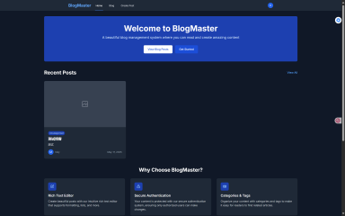

# Vue Blog 管理系统

这是一个基于 Vue 3 + Node.js + MongoDB 的博客管理系统，提供了完整的博客文章管理、用户认证等功能。

## 功能演示

### 登录界面


### 注册界面


### 首页


### 创建文章


### 个人资料


## 技术栈

### 前端
- Vue 3
- TypeScript
- Vite
- Vue Router
- Pinia
- TailwindCSS
- TipTap 编辑器
- Headless UI

### 后端
- Node.js
- Express
- MongoDB
- JWT 认证
- bcryptjs 密码加密

## 功能特性

- 用户认证（登录/注册）
- 博客文章的 CRUD 操作
- 富文本编辑器
- 响应式设计
- RESTful API

## 安装步骤

1. 克隆项目
```bash
git clone [项目地址]
cd [项目目录]
```

2. 安装前端依赖
```bash
npm install
```

3. 安装后端依赖
```bash
cd server
npm install
```

4. 配置环境变量
在 server 目录下创建 `.env` 文件，添加以下配置：
```
MONGODB_URI=你的MongoDB连接地址
JWT_SECRET=你的JWT密钥
PORT=3000
```

## 运行项目

1. 启动后端服务器
```bash
npm run server
```

2. 启动前端开发服务器
```bash
npm run dev
```

3. 构建生产版本
```bash
npm run build
```

4. 预览生产版本
```bash
npm run preview
```

## 项目结构

```
├── src/                # 前端源代码
├── server/            # 后端源代码
│   ├── controllers/   # 控制器
│   ├── middleware/    # 中间件
│   ├── models/        # 数据模型
│   └── routes/        # 路由
├── public/            # 静态资源
└── package.json       # 项目配置
```

## 开发说明

- 前端开发服务器默认运行在 `http://localhost:5173`
- 后端服务器默认运行在 `http://localhost:3000`
- API 文档请参考 `server/routes` 目录下的路由文件

## 注意事项

1. 确保已安装 Node.js (推荐 v16 或更高版本)
2. 确保已安装并启动 MongoDB 服务
3. 开发时请遵循项目的代码规范
4. 提交代码前请确保通过所有测试

## 许可证

MIT
